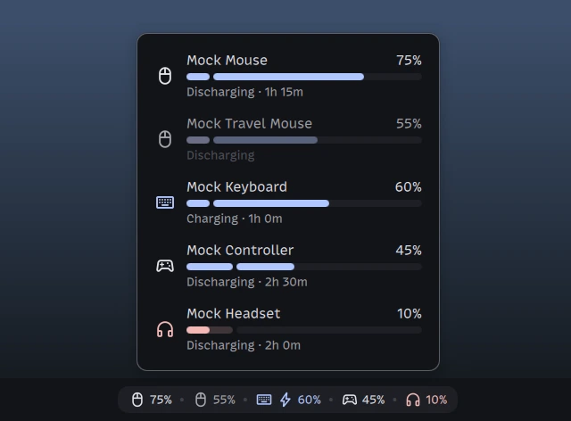

<!--
SPDX-FileCopyrightText: Elias Mueller

SPDX-License-Identifier: MIT
-->

# 🔋 Wireless Battery Widget

[](https://github.com/trin94/dms-wireless-battery-widget/actions/workflows/verify.yml)
[](https://api.reuse.software/info/github.com/trin94/dms-wireless-battery-widget)
[](LICENSES/MIT.txt)

A [Dank Material Shell](https://github.com/AvengeMedia/DankMaterialShell) plugin that shows the
battery levels of your wireless peripherals (mice, keyboards, game controllers, and headsets)
in the bar.



- 🔋 One entry per device in a single bar pill: class icon, percentage, and a bolt while
  charging. The order never reshuffles.
- 💤 A device of a retained class stays visible when it is no longer live, dimmed at its last
  reading, until the session ends. Retention is per class and defaults to on for mice and
  keyboards.
- 🚨 Low readings turn red, and a desktop notification fires when a device drops to its class's
  low threshold. It re-arms only after the battery recovers past a margin.
- 🪟 Click the pill for a popout with per-device detail: name, charge state, a level bar split
  at the low threshold, and the time estimate.
- 🫥 While no device is shown, for example right after boot before a mouse wakes, the pill
  shows a muted placeholder. Optionally it hides entirely instead.
- ⚙️ Settings for tracked classes, per-class retention and low thresholds, notifications,
  percentage labels, the charging bolt, and the placeholder. Changes apply live.
- ↕️ Renders in horizontal and vertical bars.
- 🔌 Reads `Quickshell.Services.UPower` directly. No polling.

## Requirements

You need Dank Material Shell 1.5.0 or newer, `notify-send` for the notifications, and devices
whose batteries UPower reports. To check which of your devices qualify:

```sh
for d in $(upower -e); do
    upower -i "$d" | grep -qE '^  (mouse|touchpad|keyboard|gaming-input|headset|headphones)$' && echo "$d"
done
```

Every device the loop prints gets its own entry in the pill. If a device is missing, its driver
does not expose the battery to UPower and the widget cannot see it.

The plugin also checks itself at startup: if your DMS or Quickshell installation is too old,
enabling fails and a toast says what went wrong.

## Installation

This plugin is not yet in the official third-party plugin repository, so install it manually.

Clone the repo into the DMS plugins directory:

```sh
git clone https://github.com/trin94/dms-wireless-battery-widget.git ~/.config/DankMaterialShell/plugins/dms-wireless-battery-widget
```

Or clone it anywhere and symlink it in:

```sh
git clone https://github.com/trin94/dms-wireless-battery-widget.git
mkdir -p ~/.config/DankMaterialShell/plugins
ln -s "$PWD/dms-wireless-battery-widget" ~/.config/DankMaterialShell/plugins/dms-wireless-battery-widget
```

Then add the widget to the bar from [the plugin settings](https://danklinux.com/docs/dankmaterialshell/plugin-development#5-load-it).

## Alternatives

- [mouse-battery-widget](https://github.com/trin94/mouse-battery-widget) is this plugin's
  predecessor. It shows a single mouse and nothing else; this plugin replaces it.
- [dms-mouse-battery](https://github.com/Ripolin99/dms-mouse-battery) also shows the mouse
  battery in DMS and adds DPI preset switching via Solaar or ratbagctl.

## Contributing

Set up the dev environment per the official [plugin development guide](https://danklinux.com/docs/dankmaterialshell/plugin-development#development-environment),
with one change: this is a standalone repo, so don't create a directory under `dms-plugins/`.

Instead, clone the repo into a directory of your choice, then run `just init`.

Required tools:

- [just](https://github.com/casey/just) runs the development tasks.
- [uv](https://docs.astral.sh/uv/) manages the Python environment and installs all dev dependencies itself.
- `dbus-daemon` hosts the private bus the mock bar fakes UPower on.
- `dms` drives the hot-reload recipes. It comes with Dank Material Shell.

The most important recipes (run `just` for the full list):

```sh
just init        # Set up the development environment
just fmt         # Run all formatting and lint hooks
just test        # Run the QML unit tests
just reload      # Reload the plugin after making changes
just mock start  # Show the widget in a mock bar with fake devices for every class
```

`just test` runs the `tst_*.qml` files through Qt Quick Test on a PySide6 engine, with a fake
UPower service standing in for the real daemon and QML fakes of the DMS `qs.*` modules
(`src/qs_fake`) so the pill views render under test.

The product spec lives in
[issue #1](https://github.com/trin94/dms-wireless-battery-widget/issues/1), the domain glossary
in [CONTEXT.md](CONTEXT.md), and the architectural decisions in [docs/adr](docs/adr).
